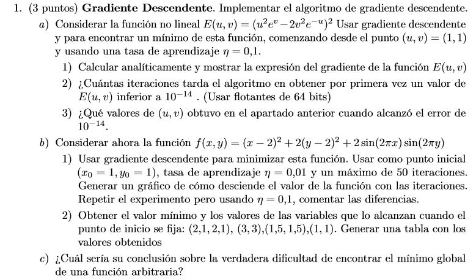
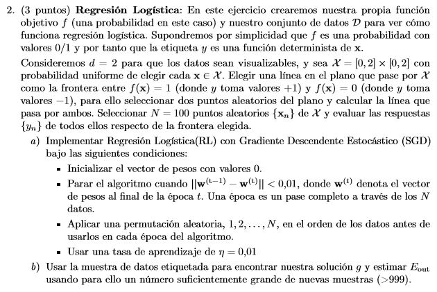
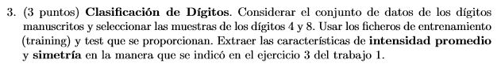
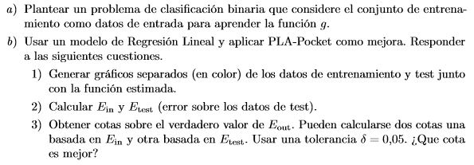
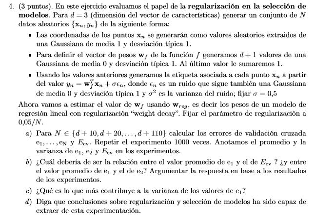
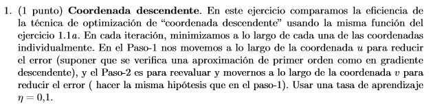
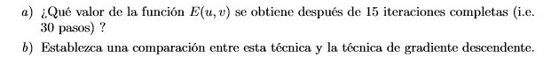
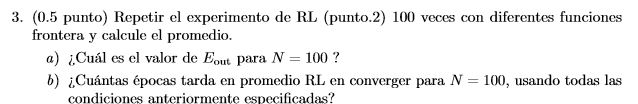

```{r setup, include=FALSE}
knitr::opts_chunk$set(echo = TRUE)
```
set.seed(7)

```{r}

#función para el ejercicio 1a
f1 = function(u,v)
{
  e = exp(1)
  valor = ((u^2)*(e^v)-2*(v^2)*e^(-u))^2
}

#función para el ejercicio 1b
f2 = function(u,v)
{
  valor = (u-2)^2 + 2*(v-2)^2 + 2*sin(2*pi*u)*sin(2*pi*v)
}

#función que se encarga de calcular el gradiente correspondiente al índice que recibe
#apartir de los puntos recibidos u y v
calcularGradiente = function(u,v,indice)
{
  e = exp(1)
  v1 = 0
  v2 = 0
  
  #elegimos la función para la que calcular el gradiente y procedemos a hacer las
  #derivadas parciales
  if(indice == 1)
  {
    v1 = 2*((u^2)*(e^v) - 2*(v^2)*(e^(-u))) * (2*(e^v)*u+2*(v^2)*(e^{-u}))
    v2 = 2*((u^2)*(e^v) - 2*(v^2)*(e^(-u))) * ((u^2)*(e^v)-4*v*(e^{-u})) 
  }
  else if(indice == 2)
  {
      v1 = 2*(u-2) + 2*sin(2*pi*v) * cos(2*pi*u) * 2*pi
      v2 = 4*(v-2) + 2*sin(2*pi*u) * cos(2*pi*v) * 2*pi
  }
  
  gradiente = c(v1,v2)
}


#Función para el gradiente descendiente
#le pasamos el punto inicial de los pesos
#la tasa de aprendizaje
#la función que consideraremos
#y el índice en función del gradiente que deseemos calcular
gradienteDescendente = function(wini, tasaAprendizaje,maxiters, f, indice,error)
{
  #almacenamos los valores de u y v
  u = wini[1]
  v = wini[2]
  #inicializamos el nuevo vector de pesos
  w = c(0,0)
  iteraciones = 0
  evaluacion = 1
  #para almacenar los valores de las evaluaciones y poder representarlas tras el 
  #método
  valores = numeric(0)
  #para almacenar los parametros u y v y conseguir devolver los minimos en la tabla
  #del ejercicio 1b2
  params = numeric(0)
  
  #en caso de que le pasemos el máximo de iteraciones hacemos que el error
  #sea menos infinito para que no se alcance esa condición nunca para salirse del while
  if(maxiters != -1)
  {
      error = -Inf
  }
  
  #hacemos previamente una lectura adelantada
  #evaluamos con la función indicada
  evaluacion2 = f(u,v)
  #para que entre en la primera iteración hacemos que se distinga al menos en una 
  #unidad
  evaluacion1 = evaluacion2 + 1
  
  
  #calculamos el número de iteraciones necesarias hasta el error indicado
  while(abs(evaluacion1-evaluacion2) > error && maxiters != 0)
  {
    #introducimos la evaluación anterior en el vector de valores
    valores = c(valores,evaluacion2)
    
    #almacenamos los valores de los parametros
    params = c(params,c(u,v))
    
    #Calculamos el gradiente
    gradiente = calcularGradiente(u,v,indice)
    
    #declaramos la dirección hacia la que movernos
    vt = -gradiente
    
    #actualizamos los pesos para la siguiente iteración
    w = wini+tasaAprendizaje*vt
    wini = w
    u = wini[1]
    v = wini[2]
    
    #generamos una nueva evaluación con la función indicada, antes
    #de eso almacenamos el valor de la evaluación actual para comparar
    #con la siguiente
    evaluacion1 = evaluacion2
    evaluacion2 = f(u,v)
    
    #contamos las iteraciones que llevamos
    iteraciones = iteraciones + 1
    
    #en caso de definir un máximo de iteraciones
    if(maxiters != -1)
    {
      maxiters = maxiters - 1
    }

    
  }
  
  #devolvemos el resultado en forma de lista, tanto las iteraciones como los valores u y v
  #alcanzados en las iteraciones realizadas
  resultado = list(it = c(iteraciones), parametros = c(u,v),
                   valores = valores, listaParametros = params)
   
}


```


#Ejercicio 1:





##Apartado a:

###Calculamos de manera analítica el gradiente descendiente de la función:
Tenemos:
\[E(u,v) = u^2 e^v - 2v^2e^{-u} \]

Hemos de calcular:
  $\nabla E(u,v) = \frac{\delta E}{\delta u} + \frac{\delta E}{\delta u}$

Con el fin de obtener el vector gradiente.

Para ello hacemos las derivadas parciales respecto de u y de v.

Derivada parcial respecto de u:

$\frac{\delta E}{\delta u}$ = \[2(E(u,v)) * 2e^vu+2v^2e^{-u} \]

Derivada parcial respecto de v:

$\frac{\delta E}{\delta v}$ = \[2(E(u,v)) * u^2e^v-4ve^{-u} \]

Ahora ya tenemos el vector gradiente con cada una de las expresiones anteriores:

$\nabla E(u,v) = (\frac{\delta E}{\delta u} , \frac{\delta E}{\delta u})$


```{r}
#inicializamos el vector de pesos
wini = c(1,1)
#inicializamos la tasa de aprendizaje
tasaAprendizaje = 0.1
#llamamos a la función del gradiente
resultado = gradienteDescendente(wini,tasaAprendizaje,-1,f1,1,10^(-4))
#CANTIDAD DE ITERACIONES HASTA CONSEGUIR UN VALOR DE E(u,v) INFERIOR A 10^(-4):
resultado$it
#VALORES DE U Y V PARA LOS QUE SE HA CUMPLIDO:
resultado$parametros
```
Como podemos observar el gradiente tarda tan sólo cuatro iteraciones en obtener una distancia entre 
evaluaciones de la función E(u,v) sucesivas inferior a 10^(-4) (en llegar a la condición de parada).
Con esta técnica de optimización iterativa alcanzamos un óptimo local siguiendo la dirección del
gradiente del vector en cada punto.

##Primera parte del apartado B del ejercicio 1:

###Calculamos de manera analítica el gradiente descendiente de la función:

Tenemos:

\[E(u,v) = (x-2)^2 + 2(y-2)^2 + 2sin(2\pi x) * sin(2\pi y) \]

Hemos de calcular:
  $\nabla E(u,v) = \frac{\delta E}{\delta u} + \frac{\delta E}{\delta u}$

Con el fin de obtener el vector gradiente.

Para ello hacemos las derivadas parciales respecto de u y de v.

Derivada parcial respecto de u:

$\frac{\delta E}{\delta u}$ = \[ 2(x-2) + 2(sin(2\pi y) * cos(2\pi x) * 2\pi) \]

Derivada parcial respecto de y:

$\frac{\delta E}{\delta u}$ = \[ 4(y-2) + 2(sin(2\pi x) * cos(2\pi y) * 2\pi) \]

Ahora ya tenemos el vector gradiente con cada una de las expresiones anteriores:

$\nabla E(u,v) = (\frac{\delta E}{\delta u} , \frac{\delta E}{\delta u})$


```{r}
#inicializamos el vector de pesos
wini = c(1,1)
#inicializamos la tasa de aprendizaje
tasaAprendizaje = 0.01
#ponemos el máximo número de iteraciones
maxiters = 50
#llamamos a la función del gradiente
resultado2 = gradienteDescendente(wini,tasaAprendizaje,maxiters,f2,2,10^(-100000))
#CANTIDAD DE ITERACIONES HASTA CONSEGUIR UN VALOR DE E(u,v) INFERIOR A 10^(-4):
resultado2$it
#VALORES DE U Y V PARA LOS QUE SE HA CUMPLIDO:
resultado2$parametros
#representación de los valores de las evaluaciones frente a las iteraciones
plot(1:resultado2$it,resultado2$valores)
```
A la vista e los resultados podemos ver que el gradiente descendente alcanza el mínimo local a partir
más o menos de la iteración 8 en el gráfico, es decir, descienden los valores progresivamente
hasta alcanzar el mñinimo en esa iteración.

Ahora realizamos el mismo experimento pero con una tasa de aprendizaje del 0.1.

```{r}
#inicializamos el vector de pesos
wini = c(1,1)
#inicializamos la tasa de aprendizaje
tasaAprendizaje = 0.1
#ponemos el máximo número de iteraciones
maxiters = 50
#llamamos a la función del gradiente
resultado2 = gradienteDescendente(wini,tasaAprendizaje,maxiters,f2,2,10^(-100000))
#CANTIDAD DE ITERACIONES HASTA CONSEGUIR UN VALOR DE E(u,v) INFERIOR A 10^(-4):
resultado2$it
#VALORES DE U Y V PARA LOS QUE SE HA CUMPLIDO:
resultado2$parametros
#representación de los valores de las evaluaciones frente a las iteraciones
plot(1:length(resultado2$valores),resultado2$valores)
```

Como comentario entre las diferencias de ambos experimentos podemos decir que al utilizar una tasa de aprendizaje pequeña estamos dando pasos pequeños a la hora de avanzar hacia el óptimo y, en caso de utilizar una tasa de aprendizaje grande como en la segunda parte (0.1) damos pasos grandes en busca del óptimo, ¿qué ocurre con esto? Pues sencillo, si el óptimo local se encuentra cerca, nos basta con dar pasos pequeños, es decir, usar una tasa de aprendizaje pequeña, ya que si usamos una grande es posible que nos pasemos el óptimo local. En el caso de que el óptimo local este lejos de la solución actual, nos conviene usar mejor una tasa de aprendizaje mayor.


#Segunda parte del apartado B del ejercicio 1:

```{r}
evaluacionesMinimas = numeric(0)
valoresU = numeric(0)
valoresV = numeric(0)
Pesos = numeric(0)


#inicializamos el vector de pesos
w1 = c(2.1,2.1)
#inicializamos la tasa de aprendizaje
tasaAprendizaje = 0.1
#ponemos el máximo número de iteraciones
maxiters = 50
#llamamos a la función del gradiente
resultado2 = gradienteDescendente(w1,tasaAprendizaje,maxiters,f2,2,10^(-100000))
#CANTIDAD DE ITERACIONES HASTA CONSEGUIR UN VALOR DE E(u,v) INFERIOR A 10^(-4):
resultado2$it
#VALORES DE U Y V PARA LOS QUE SE HA CUMPLIDO:
resultado2$parametros
#valor mínimo
minimo = min(resultado2$valores)
indiceValores = which(resultado2$valores == minimo)

evaluacionesMinimas = c(evaluacionesMinimas,minimo)
valoresU = c(valoresU,resultado2$listaParametros[indiceValores*2-1])
valoresV = c(valoresV,resultado2$listaParametros[indiceValores*2])
Pesos = c(Pesos,"(2.1,2.1)")


#inicializamos el vector de pesos
w2 = c(3,3)
#inicializamos la tasa de aprendizaje
tasaAprendizaje = 0.1
#ponemos el máximo número de iteraciones
maxiters = 50
#llamamos a la función del gradiente
resultado2 = gradienteDescendente(w2,tasaAprendizaje,maxiters,f2,2,10^(-100000))
#CANTIDAD DE ITERACIONES HASTA CONSEGUIR UN VALOR DE E(u,v) INFERIOR A 10^(-4):
resultado2$it
#VALORES DE U Y V PARA LOS QUE SE HA CUMPLIDO:
resultado2$parametros
#valor mínimo
minimo = min(resultado2$valores)
indiceValores = which(resultado2$valores == minimo)

evaluacionesMinimas = c(evaluacionesMinimas,minimo)
valoresU = c(valoresU,resultado2$listaParametros[indiceValores*2-1])
valoresV = c(valoresV,resultado2$listaParametros[indiceValores*2])
Pesos = c(Pesos,"(3,3)")

#inicializamos el vector de pesos
w3 = c(1.5,1.5)
#inicializamos la tasa de aprendizaje
tasaAprendizaje = 0.1
#ponemos el máximo número de iteraciones
maxiters = 50
#llamamos a la función del gradiente
resultado2 = gradienteDescendente(w3,tasaAprendizaje,maxiters,f2,2,10^(-100000))
#CANTIDAD DE ITERACIONES HASTA CONSEGUIR UN VALOR DE E(u,v) INFERIOR A 10^(-4):
resultado2$it
#VALORES DE U Y V PARA LOS QUE SE HA CUMPLIDO:
resultado2$parametros
#valor mínimo
minimo = min(resultado2$valores)
indiceValores = which(resultado2$valores == minimo)

evaluacionesMinimas = c(evaluacionesMinimas,minimo)
valoresU = c(valoresU,resultado2$listaParametros[indiceValores*2-1])
valoresV = c(valoresV,resultado2$listaParametros[indiceValores*2])
Pesos = c(Pesos,"(1.5,1.5)")

#inicializamos el vector de pesos
w4 = c(1,1)
#inicializamos la tasa de aprendizaje
tasaAprendizaje = 0.1
#ponemos el máximo número de iteraciones
maxiters = 50
#llamamos a la función del gradiente
resultado2 = gradienteDescendente(w4,tasaAprendizaje,maxiters,f2,2,10^(-100000))
#CANTIDAD DE ITERACIONES HASTA CONSEGUIR UN VALOR DE E(u,v) INFERIOR A 10^(-4):
resultado2$it
#VALORES DE U Y V PARA LOS QUE SE HA CUMPLIDO:
resultado2$parametros
#valor mínimo
minimo = min(resultado2$valores)
indiceValores = which(resultado2$valores == minimo)

evaluacionesMinimas = c(evaluacionesMinimas,minimo)
valoresU = c(valoresU,resultado2$listaParametros[indiceValores*2-1])
valoresV = c(valoresV,resultado2$listaParametros[indiceValores*2])
Pesos = c(Pesos,"(1,1)")

tabla = data.frame(Pesos,valoresU, valoresV, evaluacionesMinimas)

```

A continuación obtenemos los valores mínimos de la evaluación de E(u,v) en una tabla para
los pesos indicados en el ejercicio, al mismo tiempo que los parámetros usados para esa
mínima evaluación:

```{r}

tabla
```


##Apartado c del ejercicio 1

En el algoritmo realizado quizás lo más complicado sea determinar el criterio usado para la parada del algoritmo, la cual ha de definirse con un número máximo de pasos o bien por valor pequeño de la función de error en combinación con que el gradiente prácticamente no avance, es decir, si el gradiente avanza a "pasos grandes" (mayores a un determinado valor predefinido, es decir, el error) entonces seguimos con el algoritmo, en cuanto se da un "paso pequeño", terminamos la ejecución y devolvemos el valor obtenido.

 
```{r}
#Para generar matrices de datos.
#Por defecto 2 puntos entre [0,1] de 2 dimensiones
simula_unif = function (N=2,dims=2, rango = c(0,1)){
 m = matrix(runif(N*dims, min=rango[1], max=rango[2]),
 nrow = N, ncol=dims, byrow=T)
 m
}
```

## ------------------------------------------------------------------------
  Simula_recta(intervalo) una funcion que calcula los parámetros
  de una recta aleatoria, y = ax + b, que corte al cuadrado [-50,50]x[-50,50]
  (Para calcular la recta se simulan las coordenadas de 2 ptos dentro del 
  cuadrado y se calcula la recta que pasa por ellos), 
  se pinta o no segun el valor de parametro visible.

```{r}
simula_recta = function (intervalo = c(-1,1), visible=F){
  
   ptos = simula_unif(2,2,intervalo) # se generan 2 puntos
   a = (ptos[1,2] - ptos[2,2]) / (ptos[1,1]-ptos[2,1]) # calculo de la pendiente
   b = ptos[1,2]-a*ptos[1,1]  # calculo del punto de corte

   if (visible) {  # pinta la recta y los 2 puntos
       if (dev.cur()==1) # no esta abierto el dispositivo lo abre con plot
           plot(1, type="n", xlim=intervalo, ylim=intervalo)
       points(ptos,col=3)  #pinta en verde los puntos
       abline(b,a,col=3)   # y la recta
   }
   c(a,b) # devuelve el par pendiente y punto de corte
}
```


## ------------------------------------------------------------------------
  Generar_etiquetas(vector de puntos, pendiente, punto de corte)
  clasifica los puntos que hay dentro del vector recibido como parámetro
  en función de si están por encima de la recta generada por los
  valores a y b. Función hecha en clase.
```{r}
generar_etiquetas = function(puntos = simula_unif(50,2,rango=c(-50,50)), a, b)
{
	#evaluamos los puntos con la función, esto nos da la distancia desde los puntos a las
  #rectas.
	distanciaPuntoRecta = puntos[,2]-a*puntos[,1]-b
	#creamos un vector de etiquetas con el mismo tamaño que distanciaPuntoRecta
	vectorEtiquetas = distanciaPuntoRecta
	#creamos un vector de valores booleanos que separe los positivos de los negativos
	positivos = distanciaPuntoRecta >=0
	negativos = !positivos

	#ponemos los valores 1 o -1 en funcion de los vectores de booleanos obtenidos 
	#anteriormente
	vectorEtiquetas[positivos] = 1
	vectorEtiquetas[negativos] = -1

	vectorEtiquetas
}
```


#Ejercicio 2:



##Apartado a:

En este ejercicio implementamos la regresión logística, el cual es un clasificador que nos da las probabilidades de las etiquetas, no como PLA que nos daba las etiquetas (1,-1). Es una función que sea cual sea el rango de valores que tome (valores reales como en los problemas de regresión), está acotada entre 0 y 1 (como en los problemas de clasificación). 

```{r}

#función del gradiente descendente estocástico para aplicar a la 
#regresión logística
GDS = function(punto,w,etiqueta)
{
  valor = -(punto*etiqueta) / (1+(exp(crossprod(etiqueta*t(w),punto))))
  valor
  
}

#función que me calcula el módulo de un vector
moduloVector = function(w)
{
  modulo = sqrt(sum(w^2))
}

regresionLogistica = function(N,puntos,w,tasaAprendizaje,etiquetas)
{
  
 
  #inicializamos los pesos de manera que se entre en la primera iteración del bucle
  want = c(1,1,1)
  wnuevo = w
  epoca = 0
  gradiente = 0
  v = 0
  i=1
  
  #establecemos la condición de parada mientras hasta que las
  #diferencias de los pesos sean poco significativas
  while(moduloVector(want-wnuevo) >= 0.01)
  {
    
    #aplicamos una permutación aleatoria en el orden de los datos antes de usarlos
    # en cada una de las épocas
    indicesPuntos = c(1:length(etiquetas))
    indicesPuntos = sample(indicesPuntos)
    
    
    #empezamos una nueva época
    epoca = epoca + 1
    
    #actualizamos el valor de los pesos anteriores al de los nuevos cada vez #
    #que se cumple 
    #la condición
     want = wnuevo
    
    #aplicamos el gradiente estocástico
    for(i in indicesPuntos)
    {
        #llamamos a la función f3 para calcular el gradiente descendente estocástico
        g = GDS(puntos[i,],wnuevo,etiquetas[i])
      
        #aplicamos la dirección de movimiento
        v = -g
        
        #actualizamos los pesos
        wnuevo = wnuevo + tasaAprendizaje * v
    }
   
  }
  
  resultado = list(pesos = wnuevo, iteraciones = epoca)
  
  
}

```

```{r}
#para la generación de números aleatorios estáticos
set.seed(3) 
#definimos el rango de generación de puntos aleatorios. 
rango = c(0,2) 
#definimos el número de elementos
N = 100
#generamos los coeficientes a y b para evaluar los puntos con dicha función. 
coeficientes = simula_recta(rango) 
#generamos los puntos aleatorios con la función simula_unif. 
puntos = simula_unif(100,2,rango)
puntos = cbind(puntos,1)
#le pasamos esos puntos a generar_etiquetas para darle etiquetas a cada uno de los 
#puntos usando f(x,y) = y???ax???b, en función de si 
# están por encima o por debajo. 
vectorEtiquetas = generar_etiquetas(puntos, coeficientes[1], coeficientes[2]) 
#en función de si las etiquetas recibidas son positivas o negativas los representamos 
#en la gráfica de uno u otro color. 
plot(puntos, col = vectorEtiquetas+3)
#le pasamos la pendiente(a) y el punto de corte(b) a abline para que pinte la recta 
abline(coeficientes[2],coeficientes[1])
#inicializamos los pesos a 0
wini = matrix(c(0,0,0),1,3)
#definimos las tasa de aprendizaje
tasaAprendizaje = 0.01
#llamamos a la regresión logística con gradiente descendente estocástico
resultado = regresionLogistica(N,puntos,wini,tasaAprendizaje,vectorEtiquetas)
#pesos obtenidos:
resultado$pesos
#iteraciones realizadas:
resultado$iteraciones
```
#Apartado b del ejericio 2
Función que sirve para calcular el error fuera de la muestra teniendo en cuenta el vector de probabilidades
calculado con la regresión logística:
```{r}
error = function(N,puntos,w,etiquetas)
{
  i = 1
  error = 0
  suma = 0
  
  for(i in 1:length(puntos[,1]))
  {
    suma = suma + (log((1+(exp(crossprod((-etiquetas[i]*t(w)),puntos[i,]))))))
  }
  error = ((1/N)*suma)
  
}
```


```{r}

#Función que me devuelve el punto de corte y la pendiente a partir
# de los pesos obtenidos con el algoritmo PLA
calculaPuntoCortePendiente = function(vini)
{

	#inicialmente tenemos la función w1*x1 + w2*x2 + b = 0, hemos de despejar 
	#x2 para sacar el punto de corte y la pendiente, para así devolverlo:
	#Despejado -> x2 = -(((w1*x1) + b)/w2)
	pendiente = -vini[1]/vini[2]
	puntoCorte = -vini[3]/vini[2]
	PCP = c(pendiente,puntoCorte)
	PCP
}


#Función que me devuelve la cantidad de iteraciones utilizadas
#por el algoritmo PLA hasta encontrar la solución óptima
iteracionesPLA = function(puntos, label,max_iter, vini)
{
	#llamamos al algoritmoPLA
	vectorPesosEIterariones = ajusta_PLA(puntos, label, max_iter, vini)
	#almacenamos el valor de las iteraciones producidas
	numIteraciones = vectorPesosEIterariones$iteraciones
	#lo devolvemos
	numIteraciones
}


```

```{r}


#definimos el rango de generación de puntos aleatorios. 
rango = c(0,2) 
#generamos los puntos aleatorios con la función simula_unif. 
puntos = simula_unif(1000,2,rango) 
puntos = cbind(puntos,1)
#le pasamos esos puntos a generar_etiquetas para darle etiquetas a cada uno de los 
#puntos usando f(x,y) = y???ax???b, en función de si 
# están por encima o por debajo. 
vectorEtiquetas = generar_etiquetas(puntos, coeficientes[1], coeficientes[2]) 
#definimos el número de elementos
N = 1000
w = matrix(c(resultado$pesos[1],resultado$pesos[2],resultado$pesos[3]),1,3)
#calculamos el error usando win, los pesos calculados dentro de la muestra
Eout = error(N,puntos,w,vectorEtiquetas)
```

El error cometido fuera de la muestra con los pesos calculados con la regresión logística es:
```{r}

Eout

```
Valor debido en gran parte a la pequeña tasa de aprendizaje asignada a la condición de parada (0.01).

A coninuación representamos la función g junto con los datos etiquetados, donde podremos observar el error cometido:
```{r}

#en función de si las etiquetas recibidas son positivas o negativas los representamos 
#en la gráfica de uno u otro color. 
plot(puntos, col = vectorEtiquetas+3)
#pintamos la recta
PCP = calculaPuntoCortePendiente(resultado$pesos)
#le pasamos la pendiente(a) y el punto de corte(b) a abline para que pinte la recta 
abline(PCP[2],PCP[1])


```


#Ejercicio 3







Utilizamos las mismas funciones que creamos/usamos en la práctica anterior (P1)
```{r}
digit.train <- read.table("../work/datos/zip.train",
                          quote="\"", comment.char="", stringsAsFactors=FALSE)
#Nos da las imagenes que son 1 o 5 pero en pixels 
digitos15.train = digit.train[digit.train$V1==4 | digit.train$V1==8,] 
# etiquetas que tienen cada imagen. Nos dice si es un 5 o es un 1
etiquetas = digitos15.train[,1]  
ndigitos = nrow(digitos15.train)

# se retira la clase y se monta una matriz 3D: 599*16*16
#aqui almacenamos los datos
grises = array(unlist(subset(digitos15.train,select=-V1)),c(ndigitos,16,16))
etiquetasTrain = etiquetas
datos = grises
rm(digit.train) 
rm(digitos15.train)

# Para visualizar los 4 primeros

par(mfrow=c(2,2)) 
for(i in 1:4){
  imagen = grises[i,,16:1] # se rota para verlo bien
  image(z=imagen)
}

# etiquetas correspondientes a las 4 imágenes
etiquetasTrain[1:4] 
etiquetasTrain[etiquetasTrain==4] = 1
etiquetasTrain[etiquetasTrain==8] = -1

#Creamos la función fsimetria sacada del fichero de decsai "para trabajo 1"

#devuelve el grado de simetria.
fsimetria <- function(A){
  #realizamos la diferencia entre matriz original y la matriz invertida
  A = abs(A-A[,ncol(A):1])
  #calculamos la media global de los valores absolutos de la matriz
  -mean(A)
}
```


```{r}
#creamos un vector de simetria
#apply: le decimos que coja todas las imagenes que contiene "grises",
#que lo haga con el eje x(el 1, eje que me coge cada imagen completa)
# y que le aplique a todos la función fsimetria
vectorDeSimetria = apply(grises,1,fsimetria)
#creamos un vector de medias(intensidades)
vectorDeIntensidades = apply(grises,1,mean)
#los representamos
plot(vectorDeIntensidades, vectorDeSimetria, col = etiquetasTrain+3)
```

Usamos la función de regresión lineal creada en la práctica 1.
```{r}

Regress_Lin = function(datos,label){
  
  datos = cbind(datos,1)

#creamos la matriz X con columnas intensidad, simetria, bias(normalización)
	SVD= svd((t(datos)%*%datos))

#calculamos las 3 matrices con SVD (2 matrices ortogonales y una diagonal):
	D_seudo = (diag(1/SVD$d))

#para obtener al fin (t(X)*X)^(-1), realizamos lo dicho antes ->  V*(D^t)*(t(V))
	XT.X_inversa = (SVD$v)%*%(D_seudo^2)%*%(t(SVD$v))

#multiplicamos ese resultado por la traspuesta de X para obtener al fin
	#la pseudoTraspuesta de X
	X_seudo = XT.X_inversa %*% (t(datos))

#obtenemos el vector de pesos w multiplicando la pseudoTraspuesta de X por el Vector
	#de etiquetas Y
	w = X_seudo %*% label 

	w
}

```

```{r}

#Función ajusta_PLA pedida en el ejercicio.
#recibe los puntos creados de forma aleatoria, el máximo de iteraciones
#permitidas antes de encontrar la mejor solución y el vector de pesos
#inicial.
ajusta_PLA = function(datos,label,max_iter,vini) 
{
	#usamos un booleano para controlar el nº de iteraciones. 
	#Al inicio consideramos que los datos están mal clasificados
	malClasificado = TRUE
	#para la nueva implementacion del PLA metemos los puntos mal clasificados
	datosMalClasificados = numeric(0)
	#variable para iterar
	i=1
	#hacemos tantas iteraciones como el máximo preestablecido
	while (i < max_iter & malClasificado)
	{
		#cambiamos el 
		malClasificado = FALSE
		#iteramos sobre todos los puntos de forma aleatoria
		#(por ello lo del sample)
	 	for (j in sample(1:length(datos[,1])))
		{
			#en caso de que no esté bien clasificado
			#(la función sign devuelve 1 o -1)
			if (sign(crossprod(datos[j,],vini)) != label[j])
			{
				#seguimos teniendo etiquetas mal clasificadas
				malClasificado = TRUE
				datoMalClasificado = j
				break
			}
	 	}
		
		#actualizamos los valores del vector de pesos teniendo en cuenta únicamente
		#ese punto que está mal clasificado
	  #vini = vini + label[datoMalClasificado] * datos[datoMalClasificado,]
		#Iniciamos de nuevo las iteraciones sobre los puntos
		i = i+1
	}

	#devovlemos los pesos finales obtenidos y las iteraciones utilizadas
	aDevolver = list(pesos = c(vini[1],vini[2],vini[3]) , iteraciones = i)

}

```

```{r}

ajusta_PLA_Pocket = function(datos,label,max_iter,vini)
{
  #inicializamos el vector de pesos al creado por la regresión lineal
  wPocket =vini
  i = 1
  #llamamos al PLA normal con esos pesos iniciales
  resultado = ajusta_PLA(datos,label,1,wPocket)
  
  wPocket = resultado$pesos
  
  #Evaluamos el error cometido
  errorPocket = calcularError(datos,label,wPocket)
  
  
  for(i in 1:max_iter)
  {
    #obtenemos un nuevo valor para los pesos
    resultadoNew = ajusta_PLA(datos,label,1,wPocket)
    
    wNew = resultadoNew$pesos
    
    #lo evaluamos
    errorNew = calcularError(datos,label,wNew)
    
    #en caso de que sea mejor que el anterior, actualizamos los pesos
    #y también su evaluación
    if(errorNew < errorPocket)
    {
      errorPocket = errorNew
      wPocket = wNew
    }
    
  }
  
  #devolvemos los pesos
  wPocket
  
}
```

```{r}

calcularError = function(datos, label, vini)
{
  #print(dim(vini))
	cantidadMalClasificados = 0
	j=1
	#iteramos sobre todos los puntos de forma aleatoria
	#(por ello lo del sample)
	for (j in 1:nrow(datos))
	{
	  
		#en caso de que no esté bien clasificado
		#(la función sign devuelve 1 o -1)
		producto = datos[j,]%*%vini#crossprod(datos[j,],vini)
		if (sign(producto) != sign(label[j]))
		{
			cantidadMalClasificados = cantidadMalClasificados + 1
		}
	}

	porcentajeError = (100*cantidadMalClasificados) / nrow(datos)

	porcentajeError

}
```


```{r}
#compactamos en un vector el vector de simetrias y el de intensidades
vectoresDatos = cbind(vectorDeIntensidades,vectorDeSimetria)
#declaramos el tamaño de los datos
NTrain = length(vectoresDatos[,1])
#llamamos a regress_lin
resultado = Regress_Lin(vectoresDatos,etiquetasTrain)
#llamamos al pocket con el vector de pesos inicializado
#a lo devuelto por regressLin
vectorPesos = resultado
vectoresDatos = cbind(vectoresDatos,1)
pesosPLAPocket = ajusta_PLA_Pocket(vectoresDatos,etiquetasTrain,10000,vectorPesos)
pesosPLAPocket

#los representamos
plot(vectorDeIntensidades, vectorDeSimetria, col = etiquetasTrain+3)
#pintamos la función g estimada con el algoritmo el PLA_Pocket
PCP = calculaPuntoCortePendiente(pesosPLAPocket)
#le pasamos la pendiente(a) y el punto de corte(b) a abline para que pinte la recta 
abline(PCP[2],PCP[1])
```


```{r}
#Calculamos el Ein para el Pocket
Ein = calcularError(vectoresDatos,etiquetasTrain,pesosPLAPocket)
#Valor del Ein para el Pocket
Ein
```

```{r}

#Ahora procedemos a leer los datos del test para calculuar el Eout

digit.test <- read.table("../work/datos/zip.test",
                          quote="\"", comment.char="", stringsAsFactors=FALSE)

digitos15.test = digit.test[digit.test$V1==4 | digit.test$V1==8,] #Nos da las imagenes que son 1 o 5 pero en pixels 
etiquetas = digitos15.test[,1]  # etiquetas que tienen cada imagen. Nos dice si es un 5 o es un 1
ndigitos = nrow(digitos15.test)

# se retira la clase y se monta una matriz 3D: 599*16*16
grises = array(unlist(subset(digitos15.test,select=-V1)),c(ndigitos,16,16))#aqui almacenamos los datos
etiquetasTest = etiquetas
datos = grises
rm(digit.test) 
rm(digitos15.test)

# Para visualizar los 4 primeros

par(mfrow=c(2,2)) 
for(i in 1:4){
  imagen = grises[i,,16:1] # se rota para verlo bien
  image(z=imagen)
}

# etiquetas correspondientes a las 4 imágenes
etiquetasTest[1:4] 
etiquetasTest[etiquetasTest==4] = 1
etiquetasTest[etiquetasTest==8] = -1


#creamos un vector de simetria
#apply: le decimos que coja todas las imagenes que contiene "grises", que lo haga con el eje x(el 1, eje que me coge cada imagen completa)
# y que le aplique a todos la función fsimetria
vectorDeSimetria = apply(grises,1,fsimetria)
#creamos un vector de medias(intensidades)
vectorDeIntensidades = apply(grises,1,mean)
#los representamos
plot(vectorDeIntensidades, vectorDeSimetria, col = etiquetasTest+3)
#compactamos en un vector el vector de simetrias y el de intensidades
vectoresDatos = cbind(vectorDeIntensidades,vectorDeSimetria,1)
#definimos el tamaño del conjunto de datos test
NTest = length(vectoresDatos[,1])
#le pasamos la pendiente(a) y el punto de corte(b) a abline para que pinte la recta 
abline(PCP[2],PCP[1])
#Ahora calculamos el Etest
#calculamos el error fuera de la muestra
Etest = calcularError(vectoresDatos,etiquetasTest,pesosPLAPocket)
#Valor del error del test:
Etest

```


Podemos ver en la gráfica, que dentro de lo poco separables que son los datos debido a la gran existencia de ruido en las muestras, la función g estimada 
por el algorimto PLA_Pocket es bastante buena.
A continuación calculamos el Ein y el Etest 

##Apartado C

Procedemos a calcular las cotas reales de Eout y Ein.
Para ello sabemos que la dimension VC para el algoritmo del perceptrón es 3, ya que
el máximo tamaño del conjunto de los datos para el cual somos capaces de encontrar
funciones que separen a los datos es 3.

```{r}
#Calculamos dos cotas, una basándonos en el conjunto de datos del train con NTrain y otra
#basándonos en el conjunto de datos del test con NTest. 
#Hemos de saber que los datos del test son un extracto de los datos totales, separados al inicio
#de los del train, pero todos tienen la misma naturaleza. Los datos del Out son datos de fuera
#de la muestra, datos que no conocemos, para ello vamos a calcular ahora las cotas, para saber que
#valores máximos puede tomar el Eout
delta = 0.05
cotaTrain = (Ein/100) + sqrt((8/NTrain)*log(4*((2*NTrain)*3+1)/delta))
cotaTest = (Ein/100) + sqrt((8/NTest)*log(4*((2*NTest)*3+1)/delta))

#cota para Ein
cotaTrain
#cota para ETest
cotaTest

```

La mejor de las cotas calculadas es la cota calculada con los datos del Train, puesto que con los
del Test nos sale una cota mayor que 100% (150%), lo cual nos indica que como mucho el error que va a tomar Eout
será de un 100%, cosa que es más que evidente y no nos sirve de nada absolutamente. 
Con la conta calculada para los datos  del Train podemos asegurar con nivel de confianza del 95% (debido al uso de
la tolerancia = 0.05) que le valor de Eout no superará el 72%. Aún siendo menor que la cota con los datos del test, este 
valor sigue siendo alto (osea que nos dice más bien poco) debido a que la cantidad de datos (432) no es lo suficientemente grande
como para afinar más la cota superior del Eout. Lo mismo ocurre con el valor de la cota con los datos del Test, como usamos
tan sólo 51 datos, a la vista queda que son insuficientes para acotar un error fuera de la muestra, por ello es que nos sale
un porcentaje mayor al 100%.
Tal y como vemos en la desigualdad de Hoeffding y, tal y como podemos observar en este caso, la restrictividad aumenta conforme
la cantidad de datos N aumenta.


#Ejercicio 4



Función simula_gaus(N, dim, sigma) que genera un
conjunto de longitud N de vectores de dimensión dim, conteniendo números 
aleatorios gaussianos de media 0 y varianzas dadas por el vector sigma.
Por defecto genera 2 puntos de 2 dimensiones.
```{r}
set.seed(3)

simula_gaus = function(N=2,dim=2,sigma, me)
{
  if (missing(sigma)) stop("Debe dar un vector de varianzas")
  sigma = sqrt(sigma)  # para la generación se usa sd, y no la varianza
  if(dim != length(sigma)) stop ("El numero de varianzas es distinto de la dimension")
  
  # genera 1 muestra, con las desviaciones especificadas
  simula_gauss1 = function() rnorm(dim, sd = sigma, mean = me) 
  # repite N veces, simula_gauss1 y se hace la traspuesta
  m = t(replicate(N,simula_gauss1()))
  m
}
```


```{r}
set.seed(3)
#tamaño de los datos
N = 113
#dimension de los datos
d = 3
#desviación típia
sigma = c(1,1,1)
#la media indicada
media = 1
#generamos el conjunto de datos
datos = simula_gaus(N,d,sigma,media)
#añadimos el umbral
datos = cbind(datos,1)


```

```{r}
set.seed(3)
#definimos la media
media = 0
#desviación típia
sigma = c(1,1,1,1)
#dimension de los datos
d = 3
#generamos d+1 pesos con desviación tipica 1 y media 0
pesos = simula_gaus(1,d+1,sigma,media)
#al último valor le sumamos uno
pesos[4] = pesos[3] + 1

```


Función para clasificar los datos con etiquetas
```{r}
crearEtiquetas = function(w, datos, sigma, e)
{
  
  #nos definimos esta sub-función para hacer después un apply
  #y generar una etiqueta para cada uno de los datos
  f4 = function(dato)
  {
    etiqueta = crossprod(t(w),dato)+sigma*e
  }
  
  etiquetas = apply(datos,1,f4)
}
```


```{r}
set.seed(3)
#definimos la media del ruido
mediaRuido = 0
#definimos la desviación típica del ruido
sigmaRuido = 1
#definimos el sigma que nos da el ejercicio par la generación de etiquetas
sigmaEtiquetas = 0.5
#generamos el ruido
e = simula_gaus(1,1,sigmaRuido,mediaRuido)

#generamos las etiquetas tal como se indica
etiquetas = crearEtiquetas(pesos, datos, sigmaEtiquetas, e)

```

```{r}
#función para realizar las particiones del ejercicio 4
#las particiones las realizamos sobre un vector de indices
#que recibe, no sobre el conjunto de datos en sí, para
# no duplicar información
realizarParticiones = function(datos)
{
  p1 = list(train = datos[-(1:13)], test = datos[1:13])
  
  p2 = list(train = datos[-(14:23)], test = datos[14:23])
  
  p3 = list(train = datos[-(24:33)], test = datos[24:33])
  
  p4 = list(train = datos[-(34:43)], test = datos[34:43])
  
  p5 = list(train = datos[-(44:53)], test = datos[44:53])

  p6 = list(train = datos[-(54:63)], test = datos[54:63])

  p7 = list(train = datos[-(64:73)], test = datos[64:73])
  
  p8 = list(train = datos[-(74:83)], test = datos[74:83])
  
  p9 = list(train = datos[-(84:93)], test = datos[84:93])
  
  p10 = list(train = datos[-(94:103)], test = datos[94:103])
  
  p11 = list(train = datos[-(104:113)], test = datos[104:113])
  
  
  list(p1=p1, p2=p2, p3=p3, p4=p4, p5=p5, p6=p6, p7=p7, p8=p8, p9=p9, p10=p10, p11=p11)
}


```


```{r}
Regress_Lin2 = function(datos,label,lambda){

#calculamos las 3 matrices con SVD (2 matrices ortogonales y una diagonal):
	SVD= svd((t(datos)%*%datos) + diag(x = lambda,nrow = ncol(datos),ncol = ncol(datos)))
#realizamos la inversa de (t(X)*X)^(-1) == V*(D^t)*(t(V)), 
	#por tanto pasamos a calcular la pseudoInversa de D
	#la pseudo inversa de D se calcula como diag(1/D) (la diagonal de 1/D)
	D_seudo = (diag(1/SVD$d))

#para obtener al fin (t(X)*X)^(-1), realizamos lo dicho antes ->  V*(D^t)*(t(V))
	XT.X_inversa = (SVD$v)%*%(D_seudo^2)%*%(t(SVD$v))

#multiplicamos ese resultado por la traspuesta de X para obtener al fin la pseudoTraspuesta de X
	X_seudo = XT.X_inversa %*% (t(datos))

#obtenemos el vector de pesos w multiplicando la pseudoTraspuesta de X por el Vector de etiquetas Y
	w = X_seudo %*% label 

	w
}   

```


```{r}
calcularEcv1 = function(datos,etiquetas)
{
  
  errorValidacionCruzada = function(datos,etiquetas,pesos){
        error = mean(((datos%*%pesos)-etiquetas)^2)
  }
  
  
  
  #Realizamos las 11 particiones que nos pide el ejercicio
  indicesDatos = c(1:length(datos[,1]))
  indicesDatos = sample(indicesDatos)
  particiones = realizarParticiones(indicesDatos)
  
  #aqui almacenaremos los sucesivos ei
  listaEi = numeric(0)
  
  #Gminus son los pesos obtenidos con los datos del train (Dtrain)
  #el minus indica que hay K datos del conjunto total de datos (D) que no
  #han sido considerados, es decir, que han sido extraídos (Dval).
  #Por tanto el tamaño de Dtrain es N-K
  
  for(i in 1:11)
  {
    #creamos las particiones train (Z) y test
    Z = datos[particiones[[i]]$train,]
    test = datos[particiones[[i]]$test,]
    
    #cogemos los datos train y calculamos su weight decay, lo cual nos devolverá los pesos
    #que usaremos para aproximar g a f.
    #calculamos el Weight Decay(wreg)
    #definimos el parámetro de regularización
    
    Y = etiquetas[particiones[[i]]$train]
    lambda = 0.05/length(Y)
    mIdentidad = diag(ncol(Z))
    wreg = Regress_Lin2(Z,Y,lambda)
    
    
    #calculamos ei
    ei = errorValidacionCruzada(test,etiquetas[particiones[[i]]$test],wreg)
    listaEi = c(listaEi, ei)
    
  }
  #obtenemos el valor de Ecv con la media de los sucesivos ei calculados
  Ecv = sum(listaEi) / length(listaEi)
  
  #devovlemos Ecv, e1 y e2
  v = c(Ecv , listaEi[1], listaEi[2])
  v
}
```


```{r}
#realizamos el cálculo de ECV mil veces (1000 experimentos)
ResultadosExperimentos = replicate(1000,calcularEcv1(datos,etiquetas))
#res = calcularEcv1(datos,etiquetas)

matrizResultados = matrix(ResultadosExperimentos, ncol = 5, byrow = TRUE)

#La media de los Ecv es
mean(matrizResultados[,1])

#imprimimos la varianza de Ecv
var(matrizResultados[,1])

#La media de los e1 es
mean(matrizResultados[,2])

#imprimimos la varianza de los e1
var(matrizResultados[,2])

#La media de los e2 es
mean(matrizResultados[,3])

#imprimimos la varianza de los e2
var(matrizResultados[,3])

```


##Apartado B

Como podemos observar los valores promedios de Ecv, e1 y e2 son muy similares, de hecho, prácticamente iguales, lo cual es debido a que Ecv es el valor promedio de todos los ei existentes y, por la misma razón e1 y e2 son similares, debido a que son medias sobre cada uno de los datos de las validaciones con los datos del test usados para cada caso.


##Apartado C

Lo que más contribuye a la varianza del e1 es el tamaño N de los datos contribuye a que haya varianza en los valores de Ecv es el hecho de que las sucesivas medidas de los errores sean dispersas en cuanto al Ecv, es decir, la varianza es la media de las distancias de cada error de cada dato hasta el valor de Ecv, por lo que cuanto mayor sean esas distancias, mayor varianza habrá. Como podemos ver las varianzas son pequeñas.

##Apartado D

La regularización nos sirve para mediar con el sobreajuste y con ello mejorar el error fuera de la muestra, por lo que los valores de las varianzas de los errores han de ser menores que sin la aplicación de la regularización. Gracias a esto y la aplicación de la técnica de regularización weight decay los datos se ajustan mucho mejor y, como podemos observar, la dispersión de los errores obtenida es muy baja (prácticamente nula).


#BONUS

#Ejercicio 1 del bonus







```{r}
#función que se encarga de calcular el gradiente correspondiente al índice que recibe
calcularGradiente2 = function(u,v,indice)
{
  e = exp(1)
  v1 = 0
  v2 = 0
  
  #elegimos la función para la que calcular el gradiente y procedemos
  #a hacer las derivadas parciales
  if(indice == 1)
  {
    v1 = 2*((u^2)*(e^v) - 2*(v^2)*(e^(-u))) * (2*(e^v)*u+2*(v^2)*(e^{-u}))
    v2 = 2*((u^2)*(e^v) - 2*(v^2)*(e^(-u))) * ((u^2)*(e^v)-4*v*(e^{-u})) 
  }
  else if(indice == 2)
  {
      v1 = 2*(u-2) + 2*sin(2*pi*v) * cos(2*pi*u) * 2*pi
      v2 = 4*(v-2) + 2*sin(2*pi*u) * cos(2*pi*v) * 2*pi
  }
  
  gradiente = c(v1,v2)
}
```

```{r}
#función de evaluación
f1 = function(u,v)
{
  e = exp(1)
  valor = ((u^2)*(e^v)-2*(v^2)*e^(-u))^2
}

#Función para el gradiente descendiente
#le pasamos el punto inicial de los pesos
#la tasa de aprendizaje
#la función que consideraremos
#y el índice en función del gradiente que deseemos calcular
coordenadaDescendente =  function(wini, tasaAprendizaje,maxiters, f, indice,error)
{
  #almacenamos los valores de u y v
  u = wini[1]
  v = wini[2]
  #inicializamos el nuevo vector de pesos
  w = c(0,0)
  iteraciones = 0
  evaluacion = 1
  #para almacenar los valores de las evaluaciones y poder representarlas tras el método
  valores = numeric(0)
  #para almacenar los parametros u y v y conseguir devolver los minimos en la tabla
  #del ejercicio 1b2
  params = numeric(0)
  
  
  #hacemos previamente una lectura adelantada
  #evaluamos con la función indicada
  evaluacion2 = f(u,v)
  #para que entre en la primera iteración hacemos que se distinga al menos en una unidad
  evaluacion1 = evaluacion2 + 1
  
  #Calculamos el gradiente
  gradiente = calcularGradiente(u,v,indice)
  
  
  #calculamos el número de iteraciones necesarias hasta el error indicado
  while((abs(evaluacion1-evaluacion2) > error) && (maxiters != 0))
  {
    #introducimos la evaluación anterior en el vector de valores
    valores = c(valores,evaluacion2)
    
    #almacenamos los valores de los parametros
    params = c(params,c(u,v))
    
    #declaramos la direción hacia la que movernos
    vt = -gradiente
    
    #actualizamos los pesos para la siguiente iteración
    u = u+tasaAprendizaje*vt[1]
    
    #Calculamos el gradiente
    gradiente = calcularGradiente2(u,v,indice)
    
    
    #declaramos la direción hacia la que movernos
    vt = -gradiente
    
    #actualizamos los pesos para la siguiente iteración
    v = v+tasaAprendizaje*vt[2]
    
    #Calculamos el gradiente
    gradiente = calcularGradiente2(u,v,indice)
    
    #generamos una nueva evaluación con la función indicada, antes
    #de eso almacenamos el valor de la evaluación actual para comparar
    #con la siguiente
    evaluacion1 = evaluacion2
    evaluacion2 = f(u,v)
    
    
    #contamos las iteraciones que llevamos
    iteraciones = iteraciones + 1
    
    #en caso de definir un máximo de iteraciones
    if(maxiters != -1)
    {
      maxiters = maxiters - 1
    }

    
  }
  
   #devolvemos el resultado en forma de lista, tanto las iteraciones como los valores u y v
  #alcanzados en las iteraciones realizadas
  resultado = list(it = c(iteraciones), parametros = c(u,v), valores = valores, listaParametros = params)
}


```


##Apartado A

```{r}


#inicializamos el vector de pesos
wini = c(1,1)
#inicializamos la tasa de aprendizaje
tasaAprendizaje = 0.1
#llamamos a la función del gradiente
resultado = coordenadaDescendente(wini,tasaAprendizaje,15,f1,1,10^(-4))
#CANTIDAD DE ITERACIONES HASTA CONSEGUIR UN VALOR DE E(u,v) INFERIOR A 10^(-4):
resultado$it
#VALORES DE U Y V PARA LOS QUE SE HA CUMPLIDO:
resultado$parametros

```

Tras 15 iteraciones se obtiene una evaluación de:

```{r}
resultado$valores[3]
```

Puesto que, en la tercera iteración el algoritmo ya alcanza el mínimo y, las evaluaciones de los parámetros obtenidos ya
son mínimas.

##Apartado B

Como podemos observar esta técnica no solo tarda una iteración menos en encontrar los parámetros óptimos, sino que además enuentra mejores valores para los parámetros de forma que obtenemos una mejor evaluación que con la técnica del gradiente descendente.


#Ejercicio 3 del bonus




```{r}


#para la generación de números aleatorios estáticos
set.seed(3) 
#definimos el rango de generación de puntos aleatorios. 
rango = c(0,2) 
#definimos el número de elementos
N = 100
#generamos los puntos aleatorios con la función simula_unif. 
puntos = simula_unif(100,2,rango)
puntos = cbind(puntos,1)

Eout = 0
epocas = 0

for(i in 1:100)
{
  #generamos los coeficientes a y b para evaluar los puntos con dicha función. 
  coeficientes = simula_recta(rango) 
  #le pasamos esos puntos a generar_etiquetas para darle etiquetas a cada uno de los 
  #puntos usando f(x,y) = y???ax???b, en función de si 
  # están por encima o por debajo. 
  vectorEtiquetas = generar_etiquetas(puntos, coeficientes[1], coeficientes[2])
  #inicializamos los pesos a 0
  wini = matrix(c(0,0,0),1,3)
  #definimos las tasa de aprendizaje
  tasaAprendizaje = 0.01
  #llamamos a la regresión logística con gradiente descendente estocástico
  resultado = regresionLogistica(N,puntos,wini,tasaAprendizaje,vectorEtiquetas)
  epocas = epocas + resultado$iteraciones
 
  #procedemos a generar los puntos del test para validar el Eout de la iteración i
  
  #generamos los puntos aleatorios con la función simula_unif. 
  puntosTest = simula_unif(100,2,rango) 
  puntosTest = cbind(puntosTest,1)
  #le pasamos esos puntos a generar_etiquetas para darle etiquetas a cada uno de los 
  #puntos usando f(x,y) = y???ax???b, en función de si 
  # están por encima o por debajo. 
  vectorEtiquetasTest = generar_etiquetas(puntosTest, coeficientes[1], coeficientes[2]) 
  #definimos el número de elementos
  N = 100
  w = matrix(c(resultado$pesos[1],resultado$pesos[2],resultado$pesos[3]),1,3)
  #calculamos el error usando win, los pesos calculados dentro de la muestra
  Eout = Eout + error(N,puntosTest,w,vectorEtiquetasTest)

  
}

#Eout promedio
EoutPromedio = Eout/100
EoutPromedio

#Épocas promedio que tarda
epocas = epocas/100
epocas

```


